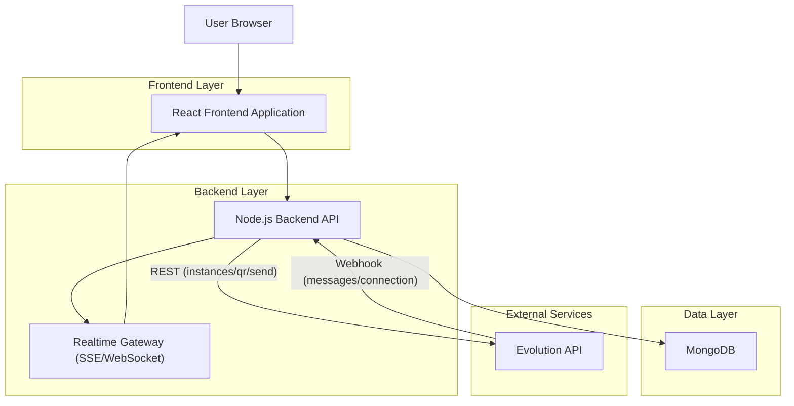
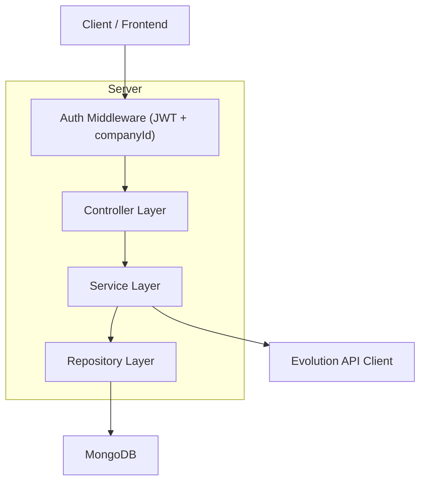
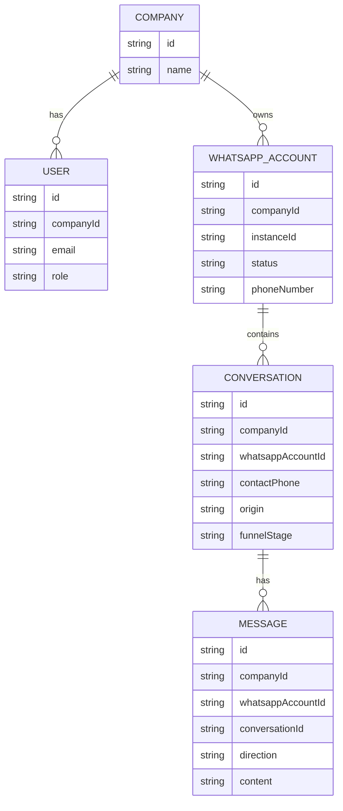

## 1.Architecture design


## 2.Technology Description
- Frontend: React@18 + vite + tailwindcss
- Backend: Node.js + Express (REST) + SSE/WebSocket
- Database: MongoDB
- Integração WhatsApp: Evolution API (REST + Webhooks)
- Auth: JWT (claims incluindo `companyId` e `userId`)

## 3.Route definitions
| Route | Purpose |
|---|---|
| /login | Autenticar usuário |
| /register | Criar conta e criar/vincular-se a Empresa |
| /dashboard | Dashboard agregado por Empresa |
| /whatsapp | Gerir conexões (múltiplos WhatsApps) |
| /inbox | Caixa de entrada (com seletor de WhatsApp) |

## 4.API definitions (If it includes backend services)
### 4.1 Core API
Auth
- POST /api/auth/register
- POST /api/auth/login
- GET /api/auth/me

Empresa / Acesso
- GET /api/company/me

WhatsApps (por Empresa)
- GET /api/whatsapp-accounts
- POST /api/whatsapp-accounts (cria instância + solicita QR)
- POST /api/whatsapp-accounts/:id/refresh-qr
- POST /api/whatsapp-accounts/:id/disconnect

Inbox
- GET /api/conversations?whatsappAccountId=&origin=&stage=&from=&to=&cursor=
- GET /api/conversations/:id
- GET /api/conversations/:id/messages?cursor=
- PATCH /api/conversations/:id (origin, funnelStage)

Dashboard
- GET /api/dashboard/summary?whatsappAccountId=&from=&to=

Webhooks (Evolution)
- POST /api/webhooks/evolution (events de mensagem/status)

### 4.2 Shared TypeScript types (contrato)
```ts
export type LeadOrigin = 'meta_ads'|'google_ads'|'organic'|'unknown'
export type OriginConfidence = 'auto'|'manual'
export type FunnelStage = 'first_contact'|'replied'|'qualified'|'proposal'|'scheduled'|'closed'|'lost'

export interface Company { id: string; name: string; createdAt: string }
export interface User { id: string; companyId: string; email: string; role: 'admin'|'member' }

export interface WhatsAppAccount {
  id: string; companyId: string;
  displayName?: string;
  phoneNumber?: string;
  instanceId: string;
  status: 'connected'|'disconnected'|'pending';
  connectedAt?: string;
}

export interface Conversation {
  id: string; companyId: string; whatsappAccountId: string;
  contactPhone: string; contactName?: string;
  origin: LeadOrigin; originConfidence: OriginConfidence;
  funnelStage: FunnelStage;
  lastMessageAt: string; unreadCount: number;
}

export interface Message {
  id: string; companyId: string; conversationId: string; whatsappAccountId: string;
  direction: 'inbound'|'outbound';
  content: string;
  mediaType?: 'text'|'image'|'audio'|'document';
  mediaUrl?: string;
  timestamp: string;
  externalMessageId: string;
}
```

## 5.Server architecture diagram (If it includes backend services)


## 6.Data model(if applicable)
### 6.1 Data model definition


### 6.2 Data Definition Language
MongoDB (sem DDL): recomendações de índices (críticos para isolamento e performance):
```js
// isolamento por Empresa
db.whatsapp_accounts.createIndex({ companyId: 1 })

db.conversations.createIndex({ companyId: 1, whatsappAccountId: 1, lastMessageAt: -1 })
db.conversations.createIndex({ companyId: 1, origin: 1, funnelStage: 1, lastMessageAt: -1 })

db.messages.createIndex({ companyId: 1, conversationId: 1, timestamp: 1 })
```

Regras de isolamento (multi-tenant)
- Todo token JWT carrega `companyId`; o backend aplica `companyId` em **todas** as queries.
- `whatsappAccountId` sempre validado: deve pertencer à mesma Empresa do usuário.
- Webhook da Evolution deve resolver `instanceId -> whatsappAccountId -> companyId` antes de persistir eventos.
