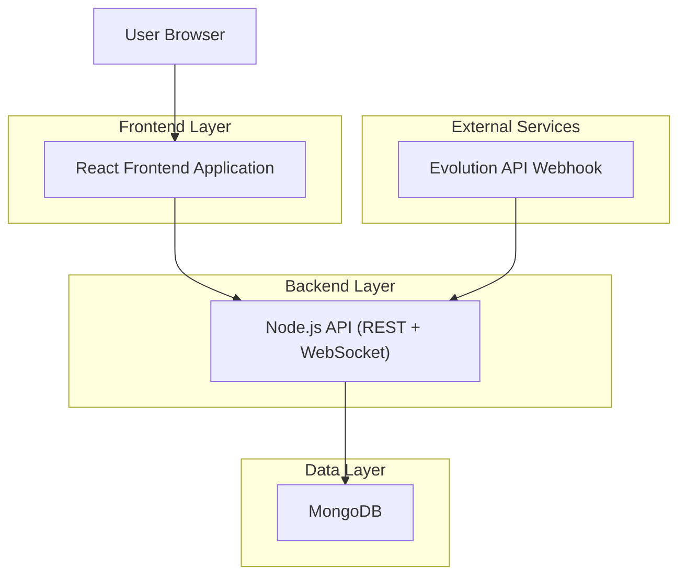
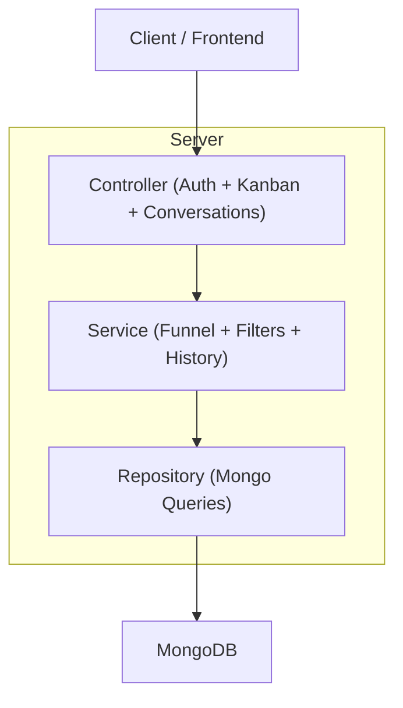

## 1.Architecture design


## 2.Technology Description
- Frontend: React@18 + vite + tailwindcss@3 + @dnd-kit (drag-and-drop)
- Backend: Node.js + Express + WebSocket (ex.: Socket.IO)
- Database: MongoDB
- Integração WhatsApp: Evolution API (webhook para novas mensagens)

## 3.Route definitions
| Route | Purpose |
|-------|---------|
| /login | Login do cliente |
| /signup | Cadastro do cliente |
| /app/kanban | Visão Kanban de leads por etapa |
| /app/conversations/:id | Detalhe do lead/conversa (pode ser página ou drawer via rota) |

## 4.API definitions (If it includes backend services)
### 4.1 Core Types (TypeScript)
```ts
export type LeadOrigin = 'meta_ads' | 'google_ads' | 'organic' | 'unknown'

export type FunnelStage =
  | 'first_contact'
  | 'replied'
  | 'qualified'
  | 'proposal'
  | 'scheduled'
  | 'closed'
  | 'lost'

export type ConversationCard = {
  id: string
  clientId: string
  contactName?: string
  contactPhone: string
  origin: LeadOrigin
  funnelStage: FunnelStage
  lastMessageAt: string
  lastMessagePreview?: string
  unreadCount: number
}

export type FunnelHistoryItem = {
  stage: FunnelStage
  changedAt: string
  changedBy: 'user' | 'system'
}
```

### 4.2 APIs
Listagem para Kanban
```
GET /api/conversations/kanban?origin=&stage=&q=&from=&to=
```
Response (exemplo)
```json
{
  "stages": ["first_contact","replied","qualified","proposal","scheduled","closed","lost"],
  "columns": {
    "first_contact": [{"id":"...","contactPhone":"...","origin":"meta_ads","funnelStage":"first_contact","lastMessageAt":"2026-04-07T12:00:00Z","unreadCount":0}],
    "replied": [],
    "qualified": [],
    "proposal": [],
    "scheduled": [],
    "closed": [],
    "lost": []
  },
  "counts": {"first_contact": 1, "replied": 0, "qualified": 0, "proposal": 0, "scheduled": 0, "closed": 0, "lost": 0}
}
```

Atualizar etapa por drag-and-drop
```
PATCH /api/conversations/:id/stage
```
Request:
| Param Name | Param Type | isRequired | Description |
|-----------|------------|------------|-------------|
| stage | FunnelStage | true | Nova etapa do funil |

Response:
| Param Name | Param Type | Description |
|-----------|------------|-------------|
| conversation | ConversationCard | Card atualizado |

Regras de segurança (multi-tenant): toda rota valida o token e aplica filtro por `clientId` no backend.

### 4.3 Real-time events
- Canal WebSocket autenticado por cliente.
- Eventos mínimos:
  - `conversation.updated` (mudança de etapa / novos campos para re-render do Kanban)
  - `conversation.message_received` (atualiza lastMessageAt, preview e unreadCount)

## 5.Server architecture diagram (If it includes backend services)


## 6.Data model(if applicable)
### 6.1 Data model definition
- `conversations`: incluir/usar campos `clientId`, `origin`, `funnelStage`, `funnelHistory[]`, `lastMessageAt`, `unreadCount`.
- `messages`: usadas para exibir detalhes; Kanban consome apenas preview + timestamps.

### 6.2 Data Definition Language
Índices recomendados (MongoDB):
- `conversations`: `{ clientId: 1, funnelStage: 1, lastMessageAt: -1 }`
- `conversations`: `{ clientId: 1, origin: 1, lastMessageAt: -1 }`
- `conversations`: `{ clientId: 1, contactPhone: 1 }`
- (opcional) `messages`: `{ clientId: 1, conversationId: 1, timestamp: -1 }`
