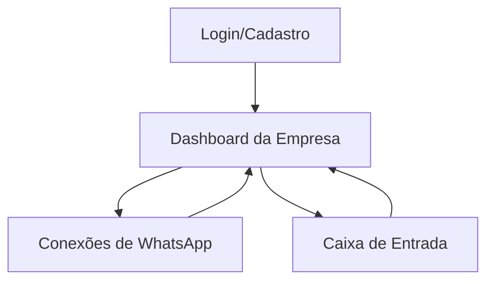

## 1. Product Overview
Plataforma SaaS multi-tenant para rastrear e organizar leads do WhatsApp por **Empresa**, conectando **vários números/instâncias** via Evolution API.
Você visualiza **dashboard agregado por empresa** e navega por conversas por WhatsApp, com identificação de origem (Meta/Google/Orgânico) e funil.

## 2. Core Features

### 2.1 User Roles
| Papel | Método de cadastro | Permissões principais |
|------|---------------------|----------------------|
| Admin da Empresa | Cadastro (e-mail/senha) criando uma Empresa | Gerir Empresa, conectar/desconectar WhatsApps, ver/editar conversas (origem/etapa), ver dashboard agregado |
| Usuário da Empresa | Convite do Admin (ou cadastro com vínculo) | Ver dashboard e inbox; editar origem/etapa (opcional, por permissão) |

### 2.2 Feature Module
O produto consiste nas seguintes páginas essenciais:
1. **Login/Cadastro**: autenticação, criação/entrada em Empresa.
2. **Dashboard da Empresa**: contadores agregados (origem/etapa), filtros e visão por WhatsApp.
3. **Conexões de WhatsApp**: adicionar múltiplos WhatsApps (QR), status e reconexão.
4. **Caixa de Entrada**: lista de conversas 1:1 por WhatsApp, mensagens, origem e etapa do funil.

### 2.3 Page Details
| Page Name | Module Name | Feature description |
|---|---|---|
| Login/Cadastro | Cadastro | Criar conta e criar/vincular-se a uma **Empresa**. |
| Login/Cadastro | Login/Sessão | Autenticar e manter sessão; carregar `companyId` no contexto do usuário. |
| Dashboard da Empresa | Resumo agregado | Exibir contadores agregados por **origem** (Meta/Google/Orgânico/Desconhecido) e por **etapa do funil** (somando todos WhatsApps da Empresa). |
| Dashboard da Empresa | Filtros | Filtrar por período, origem, etapa e (opcional) **WhatsApp específico**. |
| Dashboard da Empresa | Lista de WhatsApps | Mostrar cards/tabela com números conectados e status (conectado/desconectado/aguardando). |
| Conexões de WhatsApp | Adicionar WhatsApp | Criar nova instância/conta WhatsApp da Empresa e exibir QR Code para pareamento (Evolution API). |
| Conexões de WhatsApp | Status/Reconeção | Exibir status em tempo real; permitir atualizar QR; permitir desconectar/remover instância. |
| Caixa de Entrada | Seletor de WhatsApp | Selecionar qual WhatsApp (instância) está sendo visualizado; manter isolamento por Empresa. |
| Caixa de Entrada | Lista de conversas | Listar **somente conversas individuais (sem grupos)**; carregar histórico inicial (ex.: últimas 20) por WhatsApp; indicar não lidas. |
| Caixa de Entrada | Detalhe da conversa | Exibir mensagens enviadas/recebidas; atualizar em tempo real via webhook; persistir histórico mesmo se desconectar. |
| Caixa de Entrada | Origem do lead | Identificar origem automaticamente; permitir confirmar/corrigir manualmente; salvar confiança (auto/manual). |
| Caixa de Entrada | Funil | Definir etapa do funil por conversa; salvar histórico de mudanças (quem/quando). |

## 3. Core Process
**Fluxo (Admin da Empresa)**
1) Você cria conta → cria uma Empresa → entra no Dashboard.
2) Você adiciona 1+ WhatsApps em “Conexões” → escaneia QR → status vira “conectado”.
3) O sistema importa as últimas conversas 1:1 por WhatsApp e começa a receber novas mensagens via webhook.
4) Você acompanha o **dashboard agregado** e abre a Inbox para operar conversa a conversa.

**Fluxo (Operação diária)**
1) Você filtra o dashboard por período/origem/etapa/WhatsApp.
2) Você abre uma conversa → confere origem → move etapa do funil.

