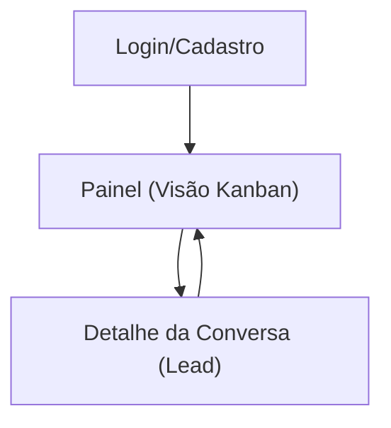

## 1. Product Overview
Recurso de **visão Kanban por cliente** para organizar e acompanhar leads (conversas) por **etapa do funil**.
Permite **filtrar**, **visualizar contagens** e **arrastar-e-soltar** cards para mudar o estágio, registrando histórico.

## 2. Core Features

### 2.1 User Roles
| Papel | Método de cadastro | Permissões principais |
|------|---------------------|-----------------------|
| Cliente (usuário da conta) | E-mail + senha | Conectar WhatsApp, visualizar conversas/leads, usar Kanban, filtrar, alterar etapa e salvar histórico |

### 2.2 Feature Module
O recurso requer as seguintes páginas essenciais:
1. **Login/Cadastro**: autenticação do cliente para acessar dados isolados (multi-tenant).
2. **Painel (Visão Kanban)**: colunas por etapa, filtros básicos, contadores e drag-and-drop para mudar etapa.
3. **Detalhe da Conversa (Lead)**: leitura do histórico e edição rápida (origem e etapa), acessível via drawer/modal a partir do Kanban.

### 2.3 Page Details
| Page Name | Module Name | Feature description |
|-----------|-------------|---------------------|
| Login/Cadastro | Autenticação | Entrar/cadastrar para acessar o workspace do cliente (isolamento por clientId). |
| Painel (Visão Kanban) | Colunas por etapa | Exibir colunas fixas do funil (Primeiro contato, Lead respondeu, Lead qualificado, Proposta enviada, Agendamento/visita marcada, Venda concluída, Perdido) com contagem por coluna. |
| Painel (Visão Kanban) | Cards de lead | Listar cada conversa como card (nome/telefone, origem, última mensagem, data da última interação, indicador de não lido quando existir). |
| Painel (Visão Kanban) | Drag-and-drop | Permitir arrastar card entre colunas; ao soltar, atualizar a etapa do funil e registrar no histórico de mudanças. |
| Painel (Visão Kanban) | Filtros básicos | Filtrar leads por origem (Meta/Google/Orgânico/Desconhecido) e por período (ex.: última mensagem em intervalo). |
| Painel (Visão Kanban) | Busca rápida | Buscar por nome/telefone/conteúdo (campo único) para reduzir a lista exibida. |
| Painel (Visão Kanban) | Atualização em tempo real | Atualizar cards/contagens quando novas mensagens chegarem ou quando a etapa mudar (próprio usuário). |
| Detalhe da Conversa (Lead) | Mensagens | Exibir histórico de mensagens enviadas/recebidas da conversa (somente 1:1, sem grupos). |
| Detalhe da Conversa (Lead) | Metadados do lead | Mostrar origem identificada (e permitir corrigir/confirmar), etapa atual e histórico de etapas. |
| Detalhe da Conversa (Lead) | Ações rápidas | Alterar etapa via dropdown (alternativa ao drag-and-drop) e refletir no Kanban. |

## 3. Core Process
**Fluxo do Cliente (usuário):**
1. Você faz login e acessa o Painel.
2. Você abre a **Visão Kanban** para ver leads distribuídos por etapa.
3. Você aplica filtros (origem, período e busca) para focar em um subconjunto.
4. Você arrasta um card para outra coluna para avançar/retroceder o lead.
5. O sistema salva a nova etapa, registra no histórico e atualiza as contagens.
6. Você clica em um card para abrir o **Detalhe da Conversa** e revisar mensagens e metadados.

